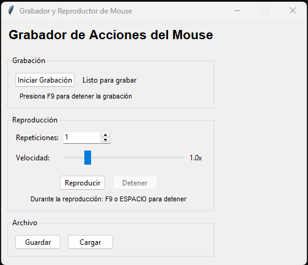

# Mouse Action Recorder & Player🐁

## Resumen
Aplicación de escritorio que permite grabar y reproducir automáticamente las acciones del mouse (movimientos, clics y scroll). 
Ideal para automatizar tareas repetitivas, testing de interfaces, demostraciones o cualquier flujo de trabajo que requiera replicar secuencias exactas de interacciones con el mouse.

## Features
Grabación completa de acciones: Captura movimientos, clics (izquierdo/derecho) y scroll del mouse
Reproducción personalizable:
  Número configurable de repeticiones (1-100)
  Control de velocidad ajustable (0.1x a 5.0x)
Controles de teclado:
  F9 para detener grabación
  F9 o ESPACIO para detener reproducción
Gestión de archivos: Guardar y cargar secuencias en formato JSON
Interfaz intuitiva: GUI con Tkinter que muestra lista detallada de acciones grabadas
Timestamps precisos: Reproduce el timing exacto entre acciones
Threading seguro: Reproducción en hilos separados sin bloquear la interfaz

## Librerías
### Principales
  tkinter: Interfaz gráfica de usuario
  pynput: Captura y control de mouse/teclado
  threading: Ejecución concurrente de reproducción
  json: Serialización de datos de acciones
### Estándar de Python
  time: Manejo de timestamps y delays
  os: Operaciones del sistema

  
